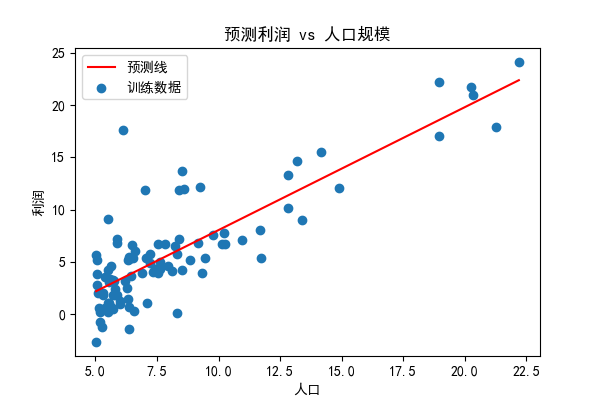
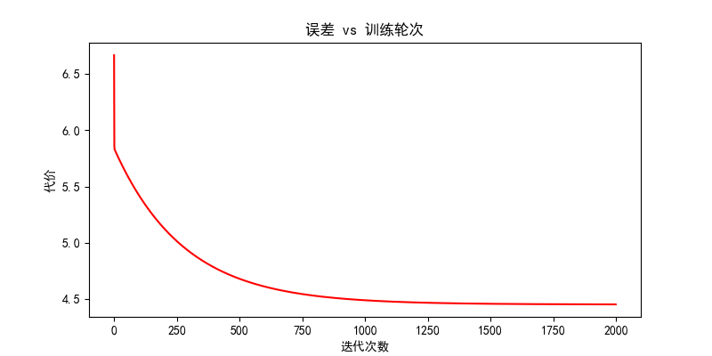
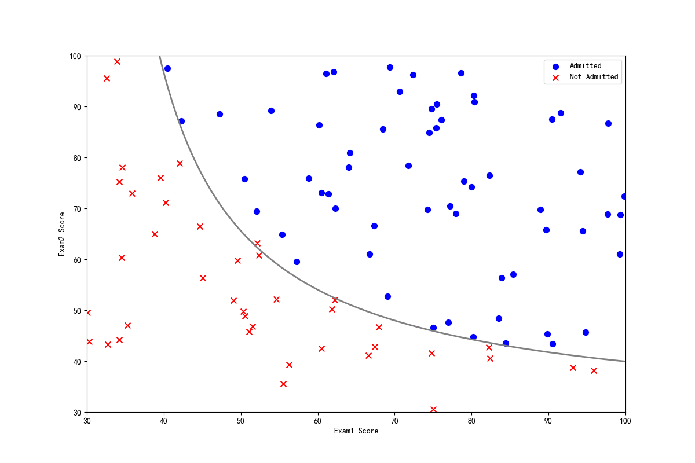
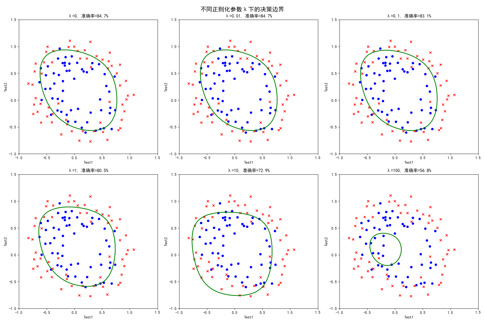
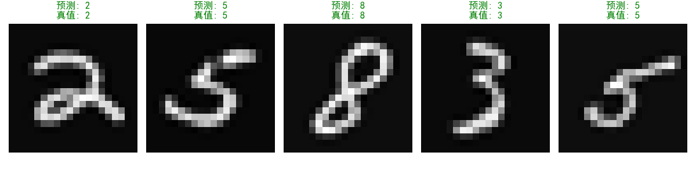
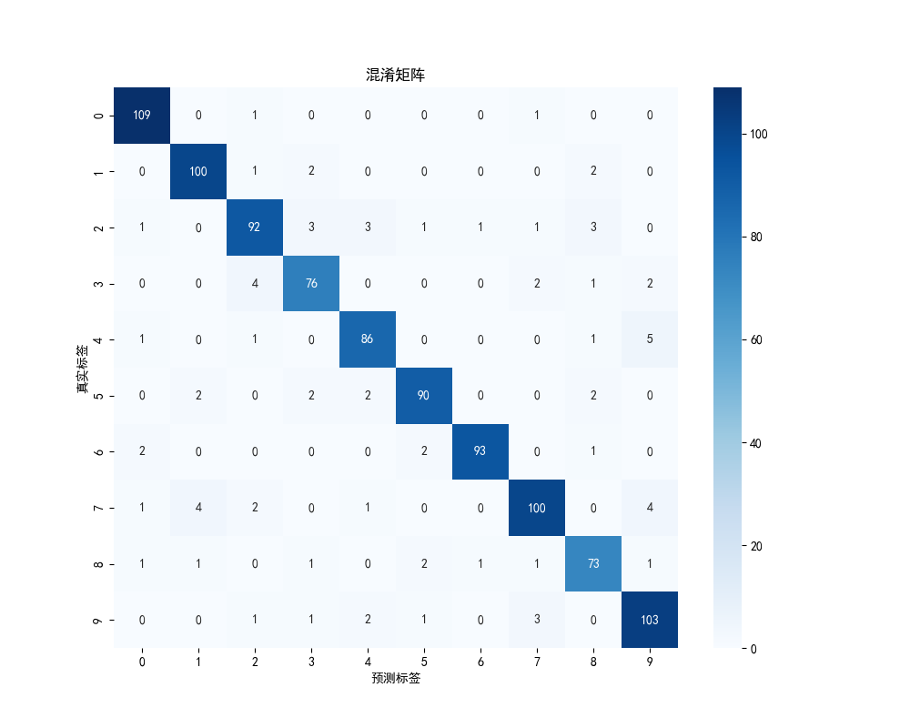
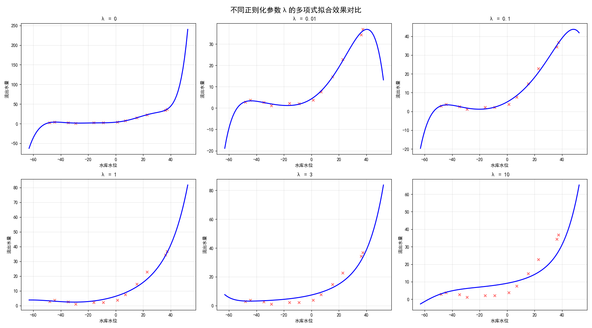
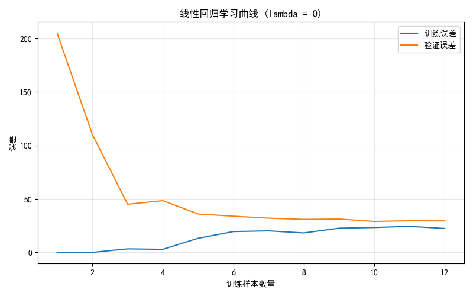

# 机器学习进阶之路：从直觉到实操 (Machine Learning Journey)🚀 

这是一个记录我学习 **2025年吴恩达 (Andrew Ng) 机器学习课程** 的实战仓库。我并没有死记硬背公式，而是通过“科普先行 + 代码推演”的方式，完成了从线性回归到深度神经网络的跨越。

------

## 我的学习方法论：启发式学习💡 

我始终认为，**理解比记忆更重要**。

### 1. 科普先行 (Intuition First)

在开始敲代码前，我倾向于通过高水平的科普视频建立大体上的感性认识：

- 🎥 [机器学习&人工智能导论](https://www.bilibili.com/video/BV1EW411u7th?p=34) (建立宏观视野)
- 🧠 [90分钟一口气搞懂神经网络](https://www.bilibili.com/video/BV1atCRYsE7x/) (清华博士：从神经元到反向传播)
- 🔢 [3Blue1Brown：深度学习核心知识点](https://www.bilibili.com/video/BV1idpkzsEwZ/) (数学直觉的巅峰：可视化理解深度学习)

### 2. 代码实操 (Hands-on Implementation)

代码演进遵循：**手动实现 (Manual) -> 工具包应用 (Scikit-learn) -> 深度学习框架 (TensorFlow/PyTorch)**。

通过这种对比，能清晰地看到自动化工具到底帮我们省去了哪些底层数学计算。

------

## 📈 核心成果可视化 (Visual Results)

### 1. 线性回归：拟合与收敛
展示模型如何通过梯度下降一步步捕捉数据趋势，并验证 Loss 是否平滑下降。

| 线性拟合效果 (Linear Fit) | 损失函数下降曲线 (Cost Curve) |
| :---: | :---: |
|  |  |

### 2. 逻辑回归：决策边界与正则化
通过调整 $\lambda$ 参数，观察模型如何在“欠拟合”与“过拟合”之间寻找平衡。

| 决策边界 (Decision Boundary) | 不同 $\lambda$ 值效果对比 |
| :---: | :---: |
|  |  |

### 3. 神经网络：手写数字识别 (MNIST)
对比 TensorFlow 与 PyTorch 实现，并使用混淆矩阵评估多分类表现。

| 识别结果展示 (Prediction) | 混淆矩阵 (Confusion Matrix) |
| :---: | :---: |
|  |  |

### 4. 模型诊断：偏差与方差分析
通过学习曲线（Learning Curve）诊断模型状态，指导下一步优化方向。

| 不同 $\lambda$ 拟合对比 | 线性学习曲线 (Learning Curve) |
| :---: | :---: |
|  |  |

---

### 1. 线性/逻辑回归拟合

展示模型如何通过梯度下降一步步“捕捉”数据趋势。

- **1.1 - 1.5**: 实现了单变量到多变量的演进。
- **2.1 - 2.3**: 引入**正则化**，有效解决了模型在复杂数据下的过拟合问题。

### 2. 训练监控：损失函数 (Loss Curve)

通过观察损失函数的下降，我可以确认模型是否收敛，以及学习率设置是否合理。

### 3. 神经网络架构对比

对比了不同深度的网络以及主流框架的实现差异：

- **3层 vs 4层**: 观察深度增加对复杂决策边界的影响。
- **TensorFlow vs PyTorch**: 同样的 4 层网络，在不同框架下的 API 调用逻辑对比（详见 `4_2` 与 `4_3`）。

------

## 仓库目录指南📂 

| **阶段**     | **文件名**    | **核心知识点**                               |
| ------------ | ------------- | -------------------------------------------- |
| **基础回归** | `1_1` ~ `1_5` | 梯度下降、正规方程、多变量处理               |
| **分类任务** | `2_1` ~ `3_1` | 逻辑回归、正则化、手写数字识别 (MNIST)       |
| **神经网络** | `3_2` ~ `4_3` | 前向传播原理、TensorFlow 与 PyTorch 框架对比 |
| **模型优化** | `5_1` ~ `5_2` | 偏差 (Bias) vs 方差 (Variance) 诊断与优化    |

------

## 阶段性总结与反思📝 

在完成线性回归、逻辑回归、神经网络基础后，我暂时搁置了决策树章节等后续章节。

**这不是放弃，而是基于“以终为始”的策略性选择：**

- **需求驱动**：当前职业需求与个人兴趣更偏向**神经网络架构设计**。在实际场景中，深度学习框架更贴合我目前的问题解决需求。
- **效率优先**：决策树作为传统机器学习的重要部分，逻辑更偏向统计规则。我选择优先深耕通用性更强的深度模型，待后续有明确业务场景时再系统补充。

------

## 参考与致谢📚 

- [Sanzo00/ML-homework](https://github.com/Sanzo00/ML-homework) (吴恩达机器学习作业参考)
- [fengdu78/AndrewNg-Notes](https://github.com/fengdu78/Coursera-ML-AndrewNg-Notes) (吴恩达老师课程个人笔记)
- [10分钟入门神经网络 PyTorch 手写数字识别](https://www.bilibili.com/video/BV1GC4y15736/?spm_id_from=333.788.top_right_bar_window_history.content.click&vd_source=4ca372d32dfd5bce8f9dec4e91bb206a)

